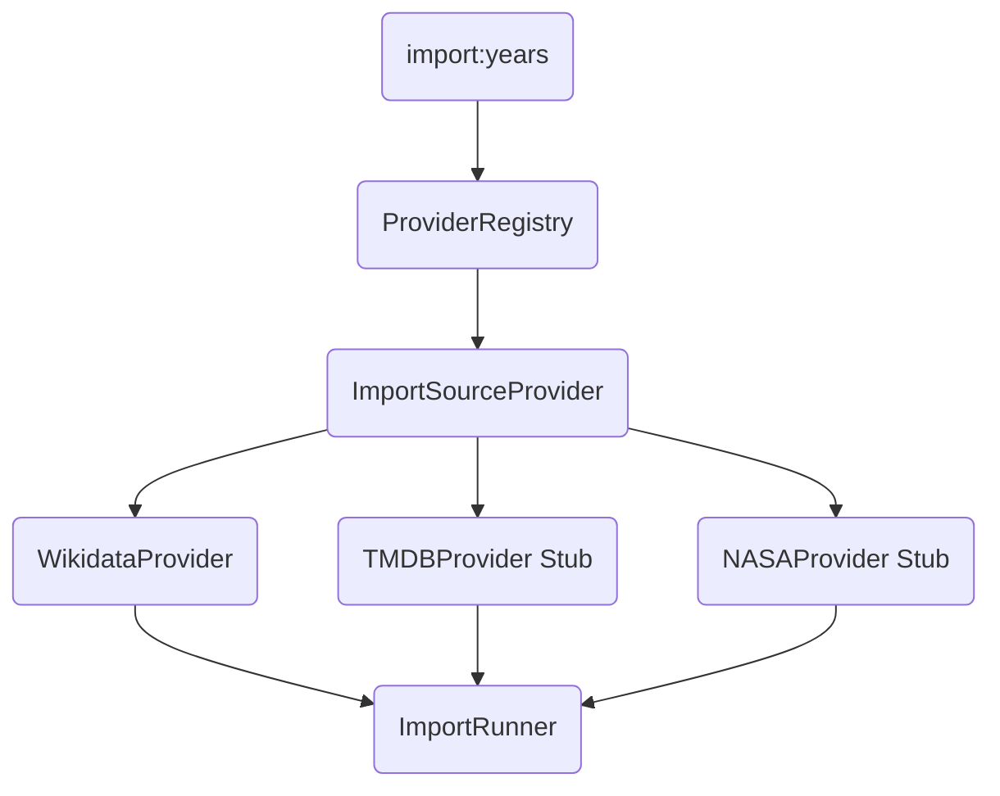

# Source Abstraction Layer (Phase 16)

The Source Abstraction Layer isolates the TimeCapsule Import Engine from the specific implementation details of external APIs like Wikidata, TMDB, or NASA. This prepares the system for massive horizontal scaling.

## Architecture

## `ImportSourceProvider` Interface
Every data provider must implement:
- **`getProviderInfo()`**: Basic metadata and licensing.
- **`getTrustLevel()`**: (1-100) How trusted is the source? (e.g. NASA = 95, Wikidata = 80).
- **`getRateLimit()`**: Suggested delay (ms) between calls.
- **`supports(type: string)`**: Can this provider fetch this type of entity?
- **`fetch(year, type, limit, dryRun)`**: Fetches the payload, normalizes it, and sends it to the Import Engine.
- **`normalize()`**: Converts provider-specific JSON to `NormalizedEntity`.

## Provider Registry
The `ProviderRegistry` acts as a central hub. Orchestrators simply ask `ProviderRegistry.getProvidersForType("films")` and loop through the available sources, keeping scripts completely decoupled from direct API clients.

## Future Extensibility
To add a new source (e.g., MusicBrainz):
1. Create `musicbrainz-provider.ts` implementing `ImportSourceProvider`.
2. Register it in `provider-registry.ts`.
3. The `import:years` CLI will automatically pick it up when running `--types albums`.
